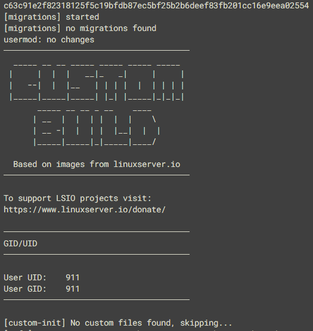
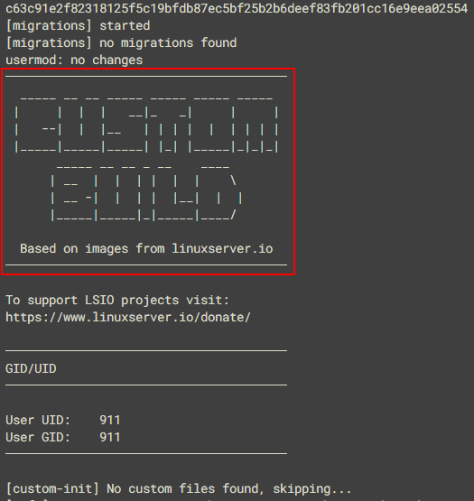
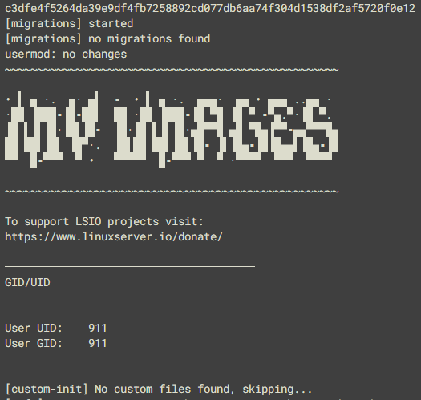

# Container Branding

If you use our base images for your own projects, or fork our downstream images to modify them, you're probably aware that we ask you to change the branding that appears in the container init logs to make it clear that your image is not associated with us. This is for your benefit as much as ours: we aren't well-equipped to provide your users with support, and you don't want them crediting us for your work.

Iif you build from one of our base images and don't change anything, your init logs will look something like this:

If you want to add your own branding, when using our base images or a forked downstream one, just place a file called `branding` containing the text you want to use into the `/etc/s6-overlay/s6-rc.d/init-adduser` folder of your image. The branding file will replace the highlighted section of the init:

On start-up, the base image will automatically load the branding into its init, allowing you to inflict whatever ASCII art you like on your users:

Hopefully this makes it simpler for everyone to manage the branding of your images when using our bases.

!!! note

    If you're branding a non-base image, you must set the ENV variable `LSIO_FIRST_PARTY=false` to avoid LSIO from overwriting it.

A final note: if you've previously overridden the `init-adduser` run file to do custom branding, we recommend switching to the above approach so that you don't miss out on any future changes to that init step.
