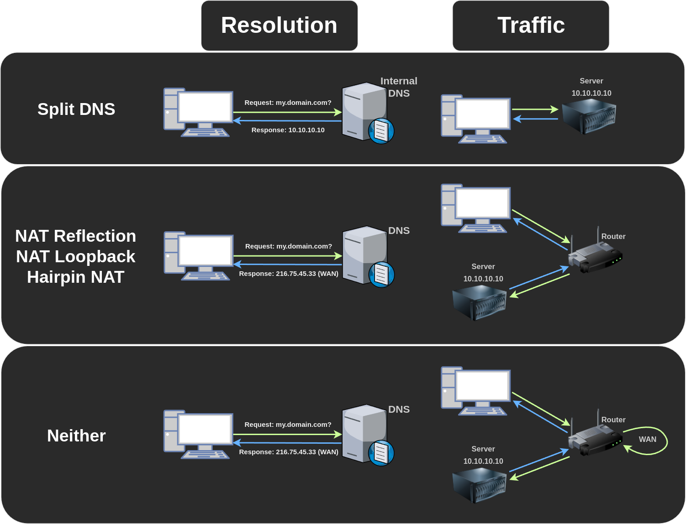

# Split DNS

Split DNS allows you to rewrite DNS requests from `*.domain.com` directly to your server instead of having to go through the router, it has several benefits:

- Faster due to not having to go through the router.
- The reverse proxy can easily differentiate between internal and external requests with allow/deny since there's no NAT.
- Things still works when the internet is down.
- Things still works when the upstream DNS isn't available.

## Requirements

- An internal reverse proxy that **listens on port 443**.
- An internal DNS that supports rewrites.

## Popular DNS Configurations

These examples assume `domain.com` is your domain and `10.10.10.10` is your reverse proxy.

### OPNSense

Navigate to Services > Unbound DNS > Overrides > Host Overrides > Add:

- Host: `*`
- Domain: `domain.com`
- Type: `A or AAAA`
- IP: `10.10.10.10`

### PFSense

Navigate to Services > DNS Resolver > General Setting > Host Overrides > Add:

- Host: `*`
- Domain: `domain.com`
- IP Address: `10.10.10.10`

### Pihole & dnsmasq

Create a file called `/etc/dnsmasq.d/domain.conf` with this contents:

```
address=/domain.com/10.10.10.10
```

### AdguardHome

Navigate to Filters > DNS rewrites > Add DNS rewrite:

- Domain name: `*.domain.com`
- IP Address: `10.10.10.10`

## Wireguard Issues

When exposing a wireguard server, the wireguard subdomain should not be split or it will break the connection while roaming between wi-fi and mobile data.

For example, you can exclude `wg.domain.com` on AdguardHome by creating another DNS rewrite of `wg.domain.com` to `wg.domain.com`, that will exclude it from the split.

## NAT Reflection / NAT Loopback / Hairpin NAT

NAT reflection is a setting on specific routers that can be enabled via a checkbox, it allows LAN devices to use the external IP and get port-forwarded without being NAT'd.

## Neither

Without split DNS or NAT reflection traffic goes out of the external IP and gets NAT'd, often getting blocked by the router since external traffic with a LAN IP source is seen as malicious.
