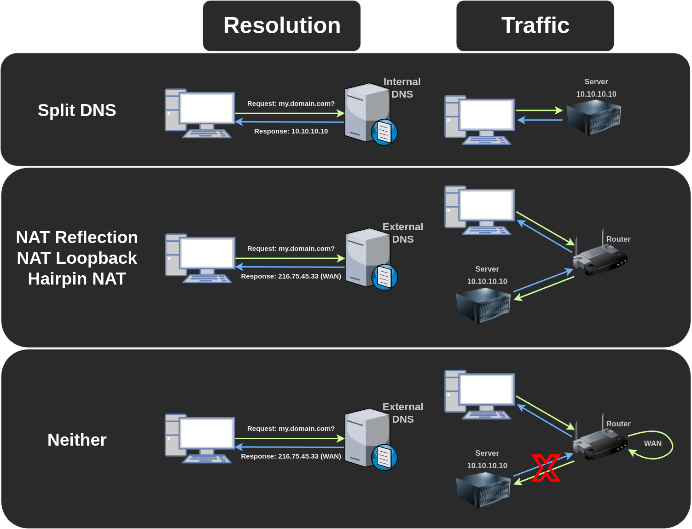

# Split DNS

Spilt DNS allows you to give different answers to DNS requests for internal and external users, so local requests for your server don't have to go via your router, it has several benefits:

- Faster due to not having to go through the router.
- The reverse proxy can easily differentiate between internal and external requests with allow/deny since there's no NAT.
- Things still work when the internet is down.
- Things still work when upstream DNS (Your ISP/Google/OpenDNS/etc) isn't available.

## Requirements

- An internal reverse proxy that **listens on port 80/443**.
- An internal DNS resolver that supports rewrites or hosting full DNS zones.

## Popular DNS Configurations

These examples assume `domain.com` is your domain and `10.10.10.10` is your reverse proxy.

### OPNSense

Navigate to Services > Unbound DNS > Overrides > Host Overrides > Add:

- Host: `*`
- Domain: `domain.com`
- Type: `A or AAAA`
- IP: `10.10.10.10`

### PFSense

Navigate to Services > DNS Resolver > General Setting > Host Overrides > Add:

- Host: `*`
- Domain: `domain.com`
- IP Address: `10.10.10.10`

### Pihole & dnsmasq

Enable `dnsmasq.d` on pihole (only required on v6 or higher) using the following command:

```
sudo pihole-FTL --config misc.etc_dnsmasq_d true
```

Create a file called `/etc/dnsmasq.d/domain.conf` with this contents:

```
address=/domain.com/10.10.10.10
```

### AdguardHome

Navigate to Filters > DNS rewrites > Add DNS rewrite:

- Domain name: `*.domain.com`
- IP Address: `10.10.10.10`

## Wireguard Issues

When exposing a wireguard server, the wireguard subdomain should not be split or it will break the connection while roaming between wi-fi and mobile data.

For example, you can exclude `wg.domain.com` on AdguardHome by creating another DNS rewrite of `wg.domain.com` to `wg.domain.com`, that will exclude it from the split.

## NAT Reflection / NAT Loopback / Hairpin NAT

NAT reflection is an alternative option to split DNS, which can provide some but not all of the same same benefits, it allows LAN devices to use the external IP and get port-forwarded without being NAT'd. 

It's usually a setting on specific routers that can be enabled via a checkbox.

Note that using Cloudflare proxy (the orange cloud) or Cloudflare tunnels will bypass it and still send traffic externally.

## Neither

Without split DNS or NAT reflection traffic goes out of your router to reach your external IP and then gets NAT'd back in, often getting blocked by the router since external traffic with a LAN IP source is seen as malicious.
