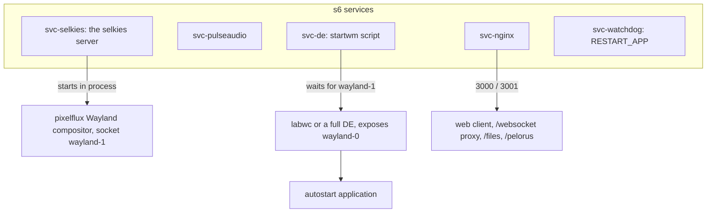

# Selkies Baseimages

**Repository:** [linuxserver/docker-baseimage-selkies](https://github.com/linuxserver/docker-baseimage-selkies) · **Registries:** `ghcr.io/linuxserver/baseimage-selkies`, `lsiobase/selkies`

`docker-baseimage-selkies` is the packaging layer of the platform, the image every Webtop and single application container is built FROM. It assembles the whole runtime, the compositor stack, Selkies, pixelflux and pcmflux, Nginx, PulseAudio, GPU detection, hardening, and the LinuxServer.io s6 service machinery, so that a downstream image only has to install an application and say how to start it.

This page is the component overview. The [Developer Guide](../developer-guide/index.md) covers building on it ([Building Custom Images](../developer-guide/building-images.md)) and its internals in depth ([Baseimage Internals](../developer-guide/baseimage-internals.md)).

## Available distros

One branch and tag per base distribution, all for x86_64 and aarch64:

| Distro | Tag |
| --- | --- |
| Alpine | `alpine324` |
| Arch | `arch` |
| Debian | `debiantrixie` |
| Fedora | `fedora44` |
| Kali | `kali` |
| Ubuntu | `ubunturesolute` |

There is deliberately **no `latest` tag** for base images. Downstream images pin a distro tag, for example `FROM ghcr.io/linuxserver/baseimage-selkies:debiantrixie`.

## What is inside

- **The LSIO foundation**: each tag builds on the corresponding LinuxServer.io distro baseimage, inheriting s6-overlay init, the `abc` user with PUID and PGID remapping, `TZ`, Docker mods, and the `/custom-cont-init.d` and `/custom-services.d` hooks.
- **Selkies** (pinned commit) installed into the `/lsiopy` virtualenv, with pixelflux 2.x and pcmflux 2.x, plus [Pelorus](pelorus.md) preinstalled.
- **The web client**: prebuilt dashboards under `/usr/share/selkies/`, selected at runtime by the `DASHBOARD` variable.
- **Compositors for both stacks**: labwc (built from source with a small IPC patch that adds the window query socket Pelorus uses) for Wayland, and a patched Xvfb (with `-vfbdevice` DRI3 support) plus Openbox for the legacy X11 fallback. A patched wlroots build makes the compositor survive pixman rendering faults instead of crashing.
- **[Selkies Desktop](selkies-desktop.md)** at `/usr/bin/selkies-desktop`, activated by env var.
- **Nginx** with the fancyindex module, serving the client, proxying the WebSocket, handling basic auth, subfolder support, and the `/files` download index.
- **PulseAudio** with null sinks (`output` and `input`) wired for stream audio and microphone return.
- **Gamepad plumbing**: the joystick interposer and fake udev libraries, preloaded globally, with device nodes created at init.
- **Quality of life**: passwordless sudo for the desktop user, all system locales prebuilt for `LC_ALL`, `proot-apps` synced into the user home for persistent app installs, Docker in Docker support for privileged containers, and notification support.

## The runtime in one diagram

At startup a chain of one shot init scripts configures everything from environment variables: Nginx substitution (ports, auth, subfolder, title), Wayland or X11 mode selection, first run copy of the autostart and menu defaults into `/config`, hardening (the `HARDEN_*` and `DISABLE_*` family), GPU detection and permission fixes, and gamepad device setup. Then the long running services above come up in dependency order.

## The two session modes

- **Wayland (default on capable hardware)**: pixelflux hosts the virtual compositor; labwc (single apps) or a full desktop (Webtop flavors) nests on it; zero copy GPU encoding is available. `PIXELFLUX_WAYLAND=true` is baked into current downstream images.
- **X11 (legacy fallback)**: patched Xvfb with DRI3, Openbox, XSHM capture. Selected with `PIXELFLUX_WAYLAND=false` or on flavors that have not moved to Wayland yet. Deprecated for GPU work.

## The downstream contract

A downstream image customizes the base by providing a handful of well known files:

| File | Purpose |
| --- | --- |
| `/defaults/autostart_wayland` and `/defaults/autostart` | The command that launches your app (Wayland and X11 variants) |
| `/defaults/menu_wayland.xml` and `/defaults/menu.xml` | The right click root menu |
| `/defaults/startwm_wayland.sh` and `/defaults/startwm.sh` | Replace the whole session for full desktop images |
| `/usr/share/selkies/www/icon.png` | The app icon used for the PWA and favicon |

Plus `ENV TITLE`, and whatever packages the app needs. That is the entire interface, [Building Custom Images](../developer-guide/building-images.md) walks through real examples.

## Versioning and builds

Images rebuild on a weekly package check cadence and on baseimage changes, through the standard LinuxServer.io Jenkins pipeline. Each downstream repository (chromium, webtop, and the rest of the fleet) is triggered from its own upstream signal, app version bumps or OS package updates, so the whole catalog stays current without manual intervention.
