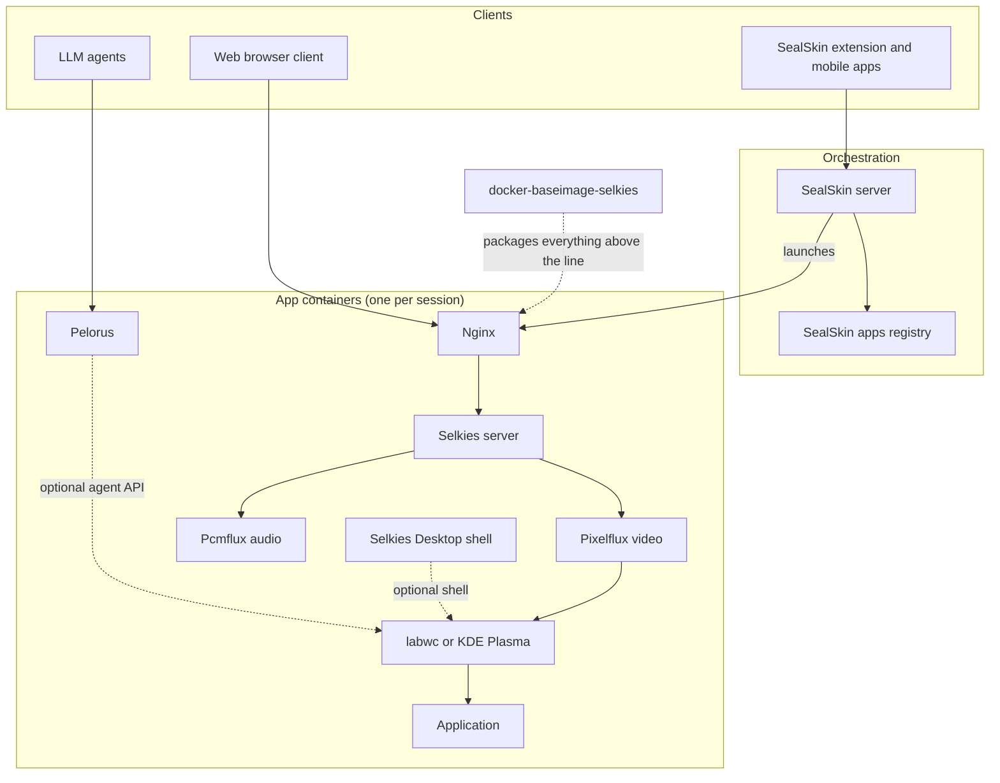

# Components

The platform is built from focused subprojects, each independently useful, each documented here with what it is, how it works, and where it sits in the stack.

## The map

## The projects

| Component | One line | Layer |
| --- | --- | --- |
| [Selkies](selkies.md) | The streaming server and web client: WebSocket protocol, input, audio, clipboard, files, sharing | Session server |
| [Pixelflux and Pcmflux](pixelflux.md) | Capture and encoding engines for video (including the in process Wayland compositor) and audio | Media pipeline |
| [Selkies Baseimages](baseimages.md) | The OCI baseimages that package the whole stack with s6, Nginx, GPU detection, and LSIO conventions | Packaging |
| [Selkies Desktop](selkies-desktop.md) | A tiny panel, start menu, taskbar, and desktop icon shell for single app containers | Optional shell |
| [SealSkin](sealskin.md) | Self hosted orchestration: users, auth, on demand container launching, extensions, and mobile apps | Orchestration |
| [SealSkin Apps Registry](sealskin-apps.md) | The YAML app manifests and autostart scripts that define the launchable catalog | Orchestration data |
| [Pelorus](pelorus.md) | Agentic interface: text based desktop state and a control API so LLMs can drive sessions | Agent layer |

## How a frame reaches your eyeball

To make the layering concrete, here is the life of one frame in a Wayland mode container:

1. The application renders into a buffer belonging to **labwc** (or KWin on KDE), which is itself a client of the headless Smithay compositor that **pixelflux** hosts in process.
2. Pixelflux composites the output. If a GPU holds the framebuffer and the encoder lives on the same GPU, the frame is passed as a DMA-BUF straight into NVENC or VA-API, zero copy. Otherwise it is read back and encoded on CPU, in parallel stripes if the software encoder is in use.
3. Only regions that changed get encoded at all; a static screen costs almost nothing, and after motion stops a high quality paint over pass restores perfect detail.
4. The encoded frame, with a small binary header, is handed to **Selkies**, which broadcasts it over the WebSocket to every connected viewer with backpressure control per client.
5. The container's **Nginx** carries that WebSocket alongside the static web client, file downloads, basic auth, and the optional Pelorus API, all on one HTTPS port.
6. In your browser, the **web client** decodes with WebCodecs and paints to a canvas, while sending your input, clipboard, mic, and gamepad state back up the same socket.

Everything above ships in one container image built on **docker-baseimage-selkies**, and **SealSkin** launches, secures, and reaps such containers on demand.
