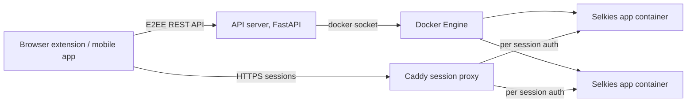

# SealSkin

**Repository:** [selkies-project/sealskin](https://github.com/selkies-project/sealskin) · **Server image:** [linuxserver/docker-sealskin](https://github.com/linuxserver/docker-sealskin) · **Site:** [sealskin.app](https://sealskin.app)

SealSkin is the orchestration layer of the platform: a self hosted client server system that manages users and launches Selkies containers on demand. It is two things at once:

1. **A turnkey VDI platform.** Install the server, install the browser extension or mobile app, and you have multi user, on demand, GPU aware application streaming with authentication, file management, and collaboration built in.
2. **A reference implementation.** If you want to build your own VDI product, kiosk fleet, or internal tool on the Selkies images, SealSkin's source shows exactly how to launch, configure, proxy, and reap these containers correctly. Every trick it uses is documented below.

The philosophy: **the browser is your operating system.** The extension intercepts what you do, clicking a link, downloading a file, right clicking an image, and redirects the action into an isolated container on your server. Suspicious files never touch your device, heavyweight apps run on server hardware, and sessions are ephemeral by default.

## Architecture

- **Control plane:** a Python FastAPI server (default port 8000). Handles the handshake, auth, app and user management, and session orchestration. All API request and response bodies are end to end encrypted with an AES-GCM session key exchanged via RSA, on top of whatever transport is in play.
- **Data plane:** a bundled Caddy instance (default port 8443, TLS with your certificate) proxies live session traffic. Containers are never exposed directly; Caddy asks the API server to resolve each session path to the right container IP and injects the container's per session basic auth credentials upstream.
- **Providers:** container launching is behind a provider abstraction, Docker via the socket is the implemented provider. This is the seam you would extend for Kubernetes or remote hosts.

## Authentication: no passwords, anywhere

SealSkin uses RSA key pairs instead of passwords. Each user has a public key on the server; the client signs a short lived JWT (5 minute expiry) with its private key for every API interaction. The server verifies against the stored public key. If the server is compromised there are no password hashes to steal. On first start the server generates an `admin` user and writes a ready to import `admin.json` client configuration containing the key material.

Users and groups are plain files on disk with per user settings: persistent storage on or off, GPU access, public sharing, hardening flags. Group settings override user settings. Admins get a full management UI inside the extension's options page.

## How it launches Selkies containers

This is the part to study if you are building your own platform. For each session SealSkin:

1. Generates a session UUID and random `CUSTOM_USER` and `PASSWORD` credentials (a fresh pair per session).
2. Injects environment variables: `SUBFOLDER=/<session_id>/` (so the container serves under its session path), `PUID`, `PGID`, `PIXELFLUX_WAYLAND`, `LC_ALL` for the user's language, and `DRINODE` plus `DRI_NODE` when a GPU is assigned.
3. Applies the app template: an admin defined bundle of the standard Selkies environment variables (UI lockdown, hardening, encoder settings, watermarks), plus `DOCKER_*` pseudo variables that translate into Docker options (privileged, devices, memory limits, network mode, and so on).
4. Mounts the home directory: a persistent per user home under `/storage/<username>/<home>`, or an ephemeral directory that is deleted when the session ends. A shared files mount lands at `/config/Desktop/files`.
5. Writes the app's **autostart script** into the mounted home before boot (`.config/labwc/autostart` for Wayland), which is how "open this URL" and "open this file" work: the script consumes `SEALSKIN_URL` or `SEALSKIN_FILE` variables. Scripts come from the [apps registry](sealskin-apps.md).
6. Starts the container with no published ports on the server's Docker network, waits for the web interface to answer, then hands the client a session URL through the Caddy proxy.
7. On session end, stops the container (containers run with auto remove) and deletes ephemeral storage.

GPU allocation is automatic: the server detects render nodes and drivers at startup, users with GPU permission pick a device at launch, Nvidia cards get the runtime and device requests wired up, Intel and AMD get the DRI device mapped.

## Features beyond launching

- **Collaboration rooms:** launch a session in room mode and invite participants with links, full control, read only, or gamepad player slots, with A/V chat signalling and up to four physical gamepads passed through. Built on the Selkies token control plane (port 8083 inside the container).
- **File manager:** browse, upload, and download files in your server side homes from the extension, with chunked transfers for large files.
- **Public shares:** password protectable, expiring public download links for files in your storage.
- **App Lab (meta apps):** launch a base app in customize mode, install software and tweak settings interactively, then commit the home directory as a golden template. New "meta apps" launch from copies of that template, no Docker knowledge required.
- **App templates:** reusable environment variable bundles for hardening and UI lockdown, applied per app from the admin UI.
- **Download interception:** the extension can intercept your next browser download and reroute the file into an isolated container instead of your disk.
- **Internationalization:** the client is localized in 18 languages, and sessions launch with the user's locale via `LC_ALL`.

## Clients

- **Browser extension** ([Chrome](https://chromewebstore.google.com/detail/sealskin-isolation/lclgfmnljgacfdpmmmjmfpdelndbbfhk), [Firefox](https://addons.mozilla.org/en-US/firefox/addon/sealskin-isolation/)): the primary client. Context menu entries (open link isolated, open file isolated, send media, search selection), download interception, the launcher popup, the admin UI, and the file manager.
- **Mobile apps** ([iOS](https://apps.apple.com/us/app/sealskin/id6758210210), [Android](https://play.google.com/store/apps/details?id=io.linuxserver.sealskin)): Capacitor apps wrapping the same client code. Sessions open in the system browser for full performance; context menu and download interception are extension only.
- Best experience is on desktop Chromium family browsers. Firefox works with some performance trade offs.

## Deployment notes

- The supported deployment is the LinuxServer.io server image from [linuxserver/docker-sealskin](https://github.com/linuxserver/docker-sealskin). The server needs the Docker socket, a `/config` volume, a `/storage` volume for user homes, and a TLS certificate and key for the session proxy.
- Configuration is via `SEALSKIN_*` environment variables (`SEALSKIN_API_PORT`, `SEALSKIN_SESSION_PORT`, `SEALSKIN_APP_RESOURCE_PATH` for the app store URL, `SEALSKIN_PUID` and `SEALSKIN_PGID` for launched containers, storage paths, auto update interval, and more).
- SealSkin expects to own its ports; it does not currently sit behind a traditional reverse proxy, the bundled Caddy is the proxy.
- App images update automatically in the background when enabled, and the app store cache refreshes hourly by default.

## Privacy

The clients talk only to the server you configure. No analytics, no tracking, no third parties; the developers have no access to your server or data. Full policy in [PRIVACY.md](https://github.com/selkies-project/sealskin/blob/master/PRIVACY.md).
