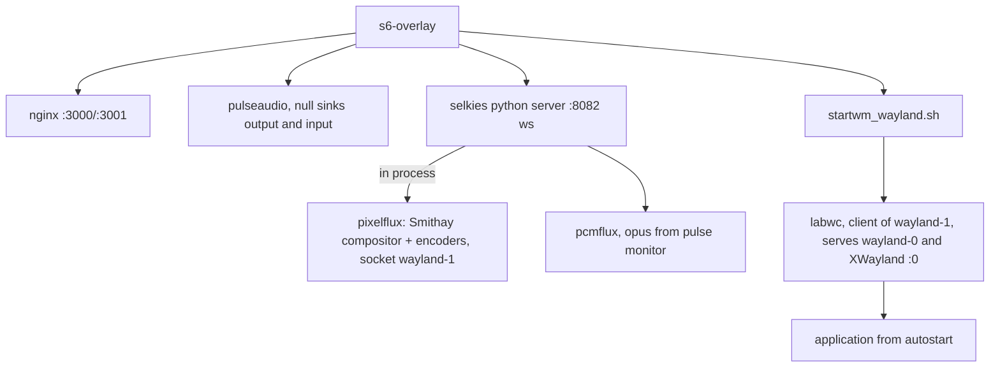

# Platform Architecture

This page is the technical deep dive into how a Selkies container actually works, from compositor to canvas. It assumes you have read the high level overview on the [home page](../index.md).

## Process topology (Wayland mode)

Everything runs in one container under s6-overlay supervision:

The subtle point people miss: **pixelflux is the display server.** When the Selkies python process starts in Wayland mode it calls `ensure_wayland_display()`, which spins up a headless Smithay based compositor inside the pixelflux extension, listening on `wayland-1`. There is no separate compositor daemon and no DRM or seat management, the "monitor" is a buffer that pixelflux owns, on GPU or in CPU memory.

labwc then runs as a *client* of that compositor (using its Wayland backend, the nested pattern) and provides window management, decorations, and XWayland on display `:0` for legacy apps. Applications connect to labwc's `wayland-0` socket. Full desktops swap labwc for a heavier nested compositor: Webtop KDE runs `kwin_wayland` nested on `wayland-1` with plasmashell on top.

In X11 fallback mode the shape is more traditional: a patched Xvfb (with DRI3 device support) provides `:1`, Openbox manages windows, and pixelflux captures via XSHM with per stripe hashing for damage detection.

## The video pipeline

### Capture and damage

- Wayland: the compositor knows exactly which rectangles changed each frame, damage tracking is free and exact.
- X11: pixelflux hashes each horizontal stripe of the framebuffer per frame (xxh3) and marks changed stripes dirty, with a "damage block" heuristic that stops re hashing regions that are continuously changing.
- Idle screens take a fast path that costs close to zero CPU.

### Encoding

Four encoders behind one policy layer:

| Path | Encoders | Shape |
| --- | --- | --- |
| CPU | x264, JPEG (and optional OpenH264) | Striped: one stripe per core, parallel encode, only dirty stripes sent |
| GPU | NVENC (Nvidia), VA-API (Intel and AMD) | Full frame, zero copy from DMA-BUF when render and encode share a device |

Quality logic is shared: infinite GOP with on demand IDR frames, CRF rate control with live retuning, and the **paint over** system, after N static frames, resend at high quality (better JPEG quality, or an H.264 burst at lower CRF), cancelled instantly by motion.

The full encoder and settings detail lives on the [Pixelflux page](../components/pixelflux.md).

### Transport and presentation

Encoded frames go to the Selkies server as callback invocations carrying a compact binary header (type, frame id, stripe geometry), and Selkies broadcasts them raw over the WebSocket, the server never re muxes or re packetizes. In the browser, WebCodecs decodes H.264, `createImageBitmap` handles JPEG stripes, and everything composites onto a canvas. Because the client acknowledges frame ids, the server maintains a per client backpressure window: slow clients get frames dropped *before* encode (keeping the H.264 reference chain valid), fast clients are never held back. Wire formats are specified in [The Streaming Protocol](protocol.md).

## The audio pipeline

PulseAudio runs with two null sinks: `output` (what apps play into) and `input` (what apps record from). Pcmflux captures `output.monitor` and Opus encodes 48kHz stereo frames natively, which Selkies broadcasts as binary WebSocket messages, decoded in the browser by an AudioDecoder worker feeding an AudioWorklet. The reverse path takes browser mic PCM, writes it into the `input` sink through a virtual source, and applications see a working microphone.

## Input

Browser events become terse text messages over the same socket (`kd,<keysym>`, `m,<x>,<y>,<mask>,<mag>`, and friends). Injection differs by stack:

- **Wayland**: injected through pixelflux's compositor seat, keyboard by scancode against a hot swappable xkb keymap, pointer absolute or relative, with unicode text batched through [waylandtyper](https://github.com/linuxserver/waylandtyper) (our maintained fork of `wtype` that fixes many bugs in the old codebase) for IME correctness. Because the compositor is headless and synthetic, external tools like xdotool do not work here, the API is the only door.
- **X11**: pynput, xdotool, and XTEST, with a keysym map and Cyrillic to QWERTY remapping so shortcuts work across layouts.

Gamepads bypass the display server entirely: Selkies serves the Linux joystick and evdev protocols over Unix sockets, and the `LD_PRELOAD` interposer plus fake udev library make applications believe `/dev/input/js0` is a real Xbox 360 pad. Four slots exist, mappable to remote players.

## The web layer

Nginx inside the container is the single front door: it serves the static client (a React dashboard over the `selkies-web-core` engine), proxies `/websocket` to the Selkies server, serves `/files` downloads with fancyindex, optionally enforces basic auth, applies the `SUBFOLDER` prefix, and proxies `/pelorus/` when the agent layer is on. The dashboard and the engine communicate over a documented `postMessage` API, which is the extension point for custom frontends.

## Sharing and multi user

One session, many sockets. Every connected client gets the same broadcast frames; roles (primary, collab, view only, player N) gate which input messages are honored. In secure mode (used by SealSkin), access requires per user tokens registered through a control plane endpoint on an internal port, and roles can be re assigned live, this is what powers collaboration rooms with granular permissions.

## Where the orchestration layer plugs in

Nothing in the container knows about SealSkin. The orchestration contract is entirely environment variables and volumes at launch: `SUBFOLDER` for path routing, `CUSTOM_USER` and `PASSWORD` for per session auth injected by the proxy, `SELKIES_MASTER_TOKEN` to switch on token mode, `DRINODE` and `DRI_NODE` for GPU placement, and a bind mounted home with an autostart script written before boot. Any scheduler that can do those five things can orchestrate the platform, that is the entire integration surface, and [SealSkin](../components/sealskin.md) is the reference implementation of it.

## Performance characteristics

Design consequences worth knowing when you build on this:

- **Static cost is near zero.** Idle sessions consume almost no CPU or bandwidth, so dense multi session hosts work, the demonstrated benchmark is eight Firefox sessions streaming  youtube on an N97 mini PC.
- **Zero copy changes the economics.** With render and encode on one GPU, the CPU cost of a session is input handling and websocket writes; system RAM bandwidth is untouched by pixels.
- **Latency is dominated by the network.** The pipeline adds a frame or two; backpressure trades throughput for freshness per client automatically.
