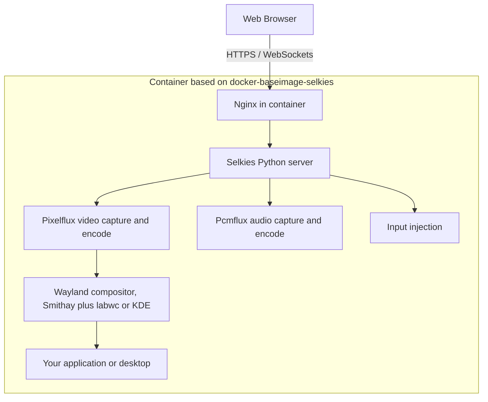

# Selkies Platform Documentation

Welcome to the documentation for the **Selkies platform** as maintained and shipped by [LinuxServer.io](https://www.linuxserver.io). Selkies is a web native remote desktop protocol and streaming stack that delivers full Linux desktops and single Linux applications to any modern web browser, with no client software to install.

This is the stack behind [Webtop](https://github.com/linuxserver/docker-webtop), the popular remote browser containers like [Chromium](https://github.com/linuxserver/docker-chromium) and [Firefox](https://github.com/linuxserver/docker-firefox), and more than one hundred single application containers. It is built from years of iteration on remote desktop delivery and is designed to be the go to standard for shipping a Linux desktop or Linux application to a web browser.

## Quick taste

```bash
docker run --rm -it \
  --shm-size=1gb \
  -p 3001:3001 \
  lscr.io/linuxserver/webtop:ubuntu-kde bash
```

Then open `https://localhost:3001` in your browser and accept the self signed certificate. That is the entire install, and `ctrl+d` in the terminal tears it all down again.

## Where to start

- **I want to run an app or desktop in my browser** — start with the [Quickstart](user-guide/quickstart.md). One docker command and you are streaming a desktop in under a minute.
- **I want to configure, secure, or GPU accelerate my container** — the [User Guide](user-guide/index.md) covers installation, GPU passthrough, the web client, hardening, and troubleshooting.
- **I want to build my own image or integrate the platform** — the [Developer Guide](developer-guide/index.md) explains the architecture, the baseimage internals, and how to package your own application or desktop.
- **I want to understand the pieces** — the [Components](components/index.md) section documents every subproject: Selkies, Pixelflux, the baseimages, SealSkin, Selkies Desktop, and Pelorus.

## The problem

Delivering a Linux desktop or GUI application to a remote user has historically meant choosing between bad options:

- **VNC** family protocols are universally compatible but struggle with motion, video playback, and modern latency expectations.
- **RDP and proprietary protocols** need dedicated client software and often licensing.
- **Plain WebRTC video streaming** treats the desktop like a video call. It handles motion well but wastes bandwidth and CPU on static screens, fights with congestion control that was tuned for cameras, and blurs text.

A desktop is not a movie. Most of the time nothing on screen is changing, and when it does change it is often a small region, a scrolling document, or a burst of full motion. The Selkies platform is built around that reality.

## The approach

Selkies is a ground up, web native remote desktop protocol designed to replace legacy VNC stacks. The core ideas:

1. **Hybrid protocol.** Damage tracking like VNC, video codecs like a streaming service. The screen is divided into horizontal stripes, only changed stripes are captured and encoded, and each stripe can be processed on a separate CPU core in parallel.
2. **Paint over quality.** H.264 handles fluid motion, and once motion stops the server repaints the static screen at high quality so text stays crisp. With FullColor 4:4:4 H.264 the painted over result is visually indistinguishable from a lossless image. A JPEG encoder remains available for older browsers that cannot decode video frames at all.
3. **WebSockets, not WebRTC.** Frames are delivered over a WebSocket connection and decoded in the browser with WebCodecs. This avoids WebRTC negotiation complexity, works cleanly through reverse proxies, and gives the server precise control over pacing and backpressure.
4. **Zero copy on Wayland.** In the current generation the display server is a virtual Wayland compositor built on [Smithay](https://github.com/Smithay/smithay). The framebuffer can live directly on a GPU, and frames are passed as DMA-BUF handles straight to the hardware encoder (VAAPI or NVENC) without a round trip through system RAM.
5. **Everything in one container.** Compositor, application, streaming server, audio, and web server all run inside a single OCI container built on `docker-baseimage-selkies`, managed by the s6 init system.

## What the platform gives you

- **A desktop in the browser.** Full desktop environments (KDE Plasma, XFCE, MATE, i3, and more) or single applications streamed over WebSockets with H.264 encoding.
- **Zero copy GPU encoding.** On the Wayland stack, frames are rendered and encoded on the GPU without ever touching system RAM, for Intel, AMD, and Nvidia hardware.
- **Runs anywhere.** The CPU encoding path is efficient enough to serve 1080p60 sessions from budget mini PCs and ARM boards. A GPU is optional, not required.
- **A complete client, not just video.** Audio in both directions, clipboard sync, file upload and download, gamepad passthrough for up to four players, touch and virtual trackpad support for mobile, IME input, and multi user session sharing.
- **Containers first.** Everything ships as OCI images built on the LinuxServer.io baseimage ecosystem, with the same PUID, PGID, and volume conventions used across all LinuxServer images.
- **An orchestration story.** [SealSkin](components/sealskin.md) provides a turnkey multi user VDI layer on top of these images, and serves as a reference implementation if you want to build your own.
- **An agentic story.** [Pelorus](components/pelorus.md) exposes desktops to LLM agents with text based desktop state and a computer use API.

## The layers

From the browser down to the application:

| Layer | Component | What it does |
| --- | --- | --- |
| Client | Selkies web client (dashboard) | Renders video with WebCodecs, plays Opus audio, captures input, provides the sidebar UI, file transfer, clipboard, gamepads, and sharing |
| Transport | WebSockets over HTTPS | Binary video, audio, and input messages, fronted by Nginx inside the container |
| Server | Selkies (Python) | Session orchestration: wires capture to the socket, injects input, manages clipboard, files, and settings |
| Video | Pixelflux (Rust with Python bindings) | Captures the framebuffer, detects damage, encodes H.264 or JPEG, CPU or GPU. In Wayland mode pixelflux itself hosts the compositor |
| Audio | Pcmflux | Captures PulseAudio output and encodes Opus for the browser, plus microphone return |
| Display server | Smithay based Wayland compositor (inside pixelflux) | Virtual framebuffer in userspace, on GPU or CPU, replaces Xvfb from the X11 era |
| Window management | labwc (single apps) or KDE Plasma (desktops) | Window decoration, tiling, desktop shell |
| Packaging | docker-baseimage-selkies | s6 services, Nginx, auth, GPU detection, user management, all the LinuxServer.io container conventions |

## The stack at a glance



Every layer of that diagram has its own page in the [Components](components/index.md) section.

## Single application vs full desktop

The platform ships in two flavors that share the same machinery:

- **Single application containers** such as `linuxserver/chromium` or `linuxserver/firefox` run one app under the lightweight labwc compositor, usually maximized and undecorated so the app looks native in the browser tab. The optional [Selkies Desktop](components/selkies-desktop.md) shell adds a minimal panel, start menu, and wallpaper when you want light multi window capability without a full desktop environment.
- **Webtop containers** run a complete desktop environment. The flagship experience is KDE Plasma running natively on Wayland (the `ubuntu-kde` tag), with additional flavors across Ubuntu, Debian, Fedora, Arch, and Alpine bases. See the [support matrix](user-guide/apps.md#webtop-full-desktops) for which flavors run Wayland today.

## Beyond a single container

- **[SealSkin](components/sealskin.md)** is the orchestration layer: a self hosted server that manages users, launches and reaps app containers on demand, handles authentication with public key cryptography, and integrates with browser extensions and mobile apps so that clicking a link or opening a file can transparently launch an isolated remote app. Use it as a turnkey VDI, or read its source as a reference for building your own platform on these images.
- **[Pelorus](components/pelorus.md)** turns any Selkies desktop into an agent operable environment. The desktop and its applications are represented as text so a chat LLM can drive them, with screenshots available when vision is needed. It supports labwc single app sessions and full KDE desktops and can be enabled with a single environment variable.
- **[Pixelflux](components/pixelflux.md)** and pcmflux are published as standalone Python packages, so the capture and encode pipeline can be embedded in your own projects without any of the container tooling.

## Design values

- **Minimal commands first.** Every container should work with `docker run --rm -it --shm-size=1gb -p 3001:3001 lscr.io/linuxserver/<app> bash`. GPU flags, volumes, and tuning are additive layers, not prerequisites. This is also the debugging philosophy: strip back to the minimal command, confirm it works, then add options one at a time.
- **CPU is a first class citizen.** The platform is tuned so that commodity hardware without any GPU can serve smooth sessions. Hardware encoding is an optimization, never a requirement.
- **All in on Wayland.** The Wayland stack unlocks true zero copy from render to encode and the performance difference over X11 is night and day. X11 remains only as a legacy fallback and will die off eventually.
- **HTTPS always.** Modern browser APIs used by the client (WebCodecs in particular) require a secure context. Every container serves HTTPS with a self signed certificate on port 3001 out of the box.
- **Open source end to end.** Every layer, from the compositor to the mobile apps, is open source and developed in public.

## About this documentation

- The **User Guide** is for people running the prebuilt containers.
- The **Developer Guide** is for people building images on top of the baseimages or integrating the underlying libraries.
- The **Components** section is a map of the subprojects that make up the whole platform, with a page for each.
